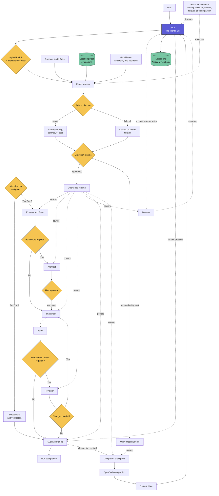

# Next Level Agent

Next Level Agent (NLA) is an OpenCode workflow for long or complex software development tasks. It keeps one coordinator responsible for the task while specialized agents handle research, architecture, implementation, review, supervision, and context recovery.

**Current NLA release:** `0.1.0-alpha.2` (`nla-v0.1.0-alpha.2`). NLA uses its
own Alpha release namespace; the inherited Superpowers package/manifests retain
their upstream `6.3.0` metadata. [`nla-version.json`](nla-version.json) is the
canonical machine-readable NLA version record.

## Philosophy

> Any task can be solved in a single prompt.

> Skills can change how a general-purpose model works. NLA adds coordination, role separation, model failover, memory, and context management around those skills.

The priorities are correctness, evidence, minimal necessary process, bounded context, recovery, and observable execution.

## Why NLA?

**NLA is a managed multi-agent system with one coordinator, specialized roles, explicit architecture, approval, and review stages, role-specific model pools, and state recovery. It is not a collection of prompts.**

> [!IMPORTANT]
> **NLA is built for efficient agentic work:** it routes each task by risk and
> complexity, selects the right model with the **Hybrid Risk & Complexity
> Assessor**, and keeps agents focused with optimized context and tools. Memory,
> review gates, model health checks, and automatic failover improve reliability,
> while local state, redacted telemetry, and optional local models protect
> privacy. The result is higher quality, faster execution, fewer wasted tokens,
> and work you can verify.

- **One coordinator.** NLA owns the goal, user conversation, approvals, sequence, shared memory, and final acceptance.
- **Risk-based routing.** Small tasks stay with NLA. Larger or riskier tasks receive only the roles and gates they need.
- **Architecture before implementation.** Important designs and Tier 3 tasks go through Architect and user approval before code changes begin.
- **Independent checks.** Reviewer checks the result, while Supervisor checks workflow state, approvals, context pressure, and evidence.
- **Role-specific model pools.** Each child role can use a preferred model and bounded fallbacks, so one failed model does not have to stop the task.
- **Efficient context use.** Child agents receive focused task packets instead of the full conversation. Completed state is kept in structured memory rather than repeatedly copied into prompts.
- **Coordinator memory.** A private ledger and Assistant Notebook preserve decisions, verified facts, blockers, and the next step across a long task.
- **Automatic context protection.** OpenCode auto-compaction handles normal context pressure. NLA adds monitoring, a Supervisor audit, a Compactor checkpoint, and state restoration for controlled recovery.
- **Telemetry.** NLA records session relationships, selected models, failover, context usage, compaction, and restoration without copying the conversation itself.

NLA tools use compact, consistent activity titles such as `Task: Review Gate F`,
`State: Complete Gate F`, and `Notebook: NLA`. OpenCode keeps the complete tool
arguments, result, and metadata available in the expandable tool details.

Prompts define role behavior. The NLA plugin provides managed NLA delegation, model failover, child-session relationships, workflow memory, compaction, restoration, and telemetry.

## At a Glance



## What NLA Can Do

> **GPU Top**
>
> To test NLA on a real development task, I asked it to create an htop-style terminal monitor for an AMD Radeon 780M, Ollama models, and GPU processes.
>
> After I selected the initial parameters and approved the design, NLA planned the work, used specialized implementation and review roles, fixed issues found during review, ran the tests, and completed the working application without manual coding intervention.
>
> [View the GPU Top source and original task](https://github.com/pickleshell/utilities/tree/main/gpu-top).

## Architecture and Roles

NLA is the only user-facing coordinator and owns the shared memory. Specialized roles receive bounded assignments, work in child sessions, and return evidence to NLA.

| Role | Responsibility | Typical use |
| --- | --- | --- |
| **NLA** | Coordinates the complete task, talks to the user, owns memory, accepts the result, and handles direct Tier 0/1 work | Every task |
| **Router** | Classifies tasks and selects the appropriate workflow route and model class | At task-routing and model-routing boundaries |
| **Explorer** | Finds relevant files, symbols, dependencies, facts, and local risks | Tier 2/3 discovery |
| **Scout** | Researches official documentation, versions, and external dependencies | When local evidence is insufficient |
| **Architect** | Compares designs and defines boundaries, interfaces, failure handling, risks, and tests | Tier 3 design gate |
| **Implementer** | Performs a bounded code change and returns verification evidence | Approved Tier 2/3 implementation |
| **Reviewer** | Independently checks the scope, change, evidence, and quality | Risk-based review gate |
| **Browser** | Researches sites, extracts information, interacts with web applications, and verifies browser state within task-owned permissions | Optional isolated browser tasks through a backend-independent capability; initially Playwright MCP |
| **Supervisor** | Audits alignment, approvals, blockers, loops, context pressure, and completion evidence | Tier 3 gates, anomalies, compaction, completion |
| **Compactor** | Optimizes model input: compresses structured state, shapes prompts, and prunes tool schemas to a small relevant shortlist | Before controlled compaction and before model invocation when prompt optimization is enabled |

The primary NLA coordinator can inspect the currently loaded model pool for
every role with `nla_models`. After an operator edits the resolved pool file,
`nla_models_reload` validates and atomically loads the new snapshot without
restarting OpenCode; a subsequent `nla_models` call confirms the effective
role-to-model ordering. New tasks use the reloaded snapshot, while active tasks
continue with the pool snapshot they already received.

### Recommended models by role

> [!WARNING]
> For normal NLA operation, the project maintainer **strongly recommends
> Luna as the NLA coordinator**.
> It is also the recommended choice whenever a role's model is uncertain, and
> the final fallback for other role pools. This is an operational recommendation
> based on development use, rather than a guarantee of provider availability or
> correctness. Confirm the exact provider/model ID and tool support in your runtime.

| Role | Recommended model or model class | Selection guidance |
| --- | --- | --- |
| **NLA** | **Luna** | The coordinator runs throughout the task: prioritize stable delegation, tool use, approval handling, and state preservation, with affordable input tokens for its growing context. A cheap coordinator that loses control can waste the entire workflow. **For example:** Luna. |
| **Router** | A fast, inexpensive model with reliable structured output; Luna when uncertain | Frequent, small decisions favor low latency and low cost. Validate classification and escalation: a routing mistake can skip a required gate or send work to an unsuitable role. **For example:** Luna; evaluate local Qwen3.8 if local latency is acceptable. |
| **Explorer** | A capable local model, or an inexpensive cloud model with a large usable context window | Repository discovery reads substantial file content. Favor private local inference, low input cost, accurate file/symbol references, and reliable search tools. Return focused evidence rather than copying whole files to the coordinator. **For example:** local Qwen3.8 → Luna. |
| **Scout** | An inexpensive model with reliable research tools and sufficient context | External research favors source accuracy, version checking, and economical processing of long documents. A local model can perform inference locally, but web searches still send queries externally. Avoid including private repository content in search queries. **For example:** Luna, or local Qwen3.8 with working documentation/search tools. |
| **Architect** | A strong reasoning model such as Sol, even at a higher price | Architect is invoked selectively at design gates, rather than for every edit. A strong, more expensive model is justified when it prevents costly mistakes in interfaces, safety, failure handling, and tradeoffs; price alone does not establish quality. Keep its input focused on requirements and relevant evidence. **For example:** Sol → Luna. |
| **Implementer** | A fast, cheap or free model that demonstrably codes well | Repeated edit/test cycles favor speed and low cost. Any capable coding model can fit a bounded task, including local models, provided editing tools, tests, and scope discipline work. Measure time and cost per accepted change, including retries; escalate persistent failures. **For example:** Big Pickle or local Qwen3.8 → Luna. |
| **Reviewer** | A stable model with inexpensive input tokens and demonstrated defect detection | Reviews consume diffs, contracts, and test evidence, so input cost and reliable reasoning matter more than output speed alone. Use an independent session and preferably a different model from the implementer. Provide enough surrounding code to assess behavior; a different model is not proof of review quality. **For example:** evaluate Big Pickle or Qwen3.7 Plus; Luna is the dependable default/fallback. Reserve expensive expert review for an explicitly approved, bounded scope. |
| **Browser** | A reliable, economical tool-using model | Favor faithful extraction, semantic locators, task permission discipline and deterministic checks over expensive reasoning. Page content is untrusted, and cloud inference may receive extracted data. **For example:** Luna; evaluate local Qwen for private browser observations. Optional: configure a backend and enable the role first. |
| **Supervisor** | Luna, or another model validated for workflow auditing | Favor reliable judgment over coding throughput: detect missing approvals, repeated failures, stale evidence, and unsupported completion claims. Use compact state/evidence packets to keep auditing inexpensive. **For example:** Luna. |
| **Compactor** | **Luna or a capable local Qwen model** | Large inputs favor local privacy or inexpensive cloud input tokens. Faithful compression is essential: losing constraints, approvals, blockers, or revision-bound evidence can compromise later execution. Test preservation and structured output, not just compression ratio; excessive compaction can add latency. **For example:** local Qwen3.8 → Luna, or Luna first for predictable compression. |

The examples illustrate model choices and fallback order, not a ready-to-copy
configuration. Verify provider access and configure the appropriate runtime/backend,
especially when combining local and cloud utility models.
Big Pickle and Qwen3.7 Plus both produced successful patches in the
[ledger patch benchmark](https://pickleshell.github.io/model-comparison.html).
These results support evaluating them as affordable review candidates, but do
not establish their quality as reviewers. Validate review behavior separately,
and confirm current pricing and availability before use.

For roles that process large amounts of repository content or local files,
prefer a capable local model or an inexpensive cloud model with a large usable
context window. A large advertised window alone is insufficient: test the model
with NLA's actual tools and bounded assignments. Local inference also needs
adequate memory and request timeouts. Keep fallback pools short and ordered;
cooldown and defective-model handling can skip an unavailable binding, but do
not make an unsuitable model reliable. These recommendations do not change
repository defaults or your operator override automatically.

### Balancing quality, privacy, speed, and autonomy

Spend model capability where errors have the greatest downstream cost: the
coordinator, architecture decisions, and independent verification. Use fast,
economical models for bounded execution and high-volume discovery. Validate
each role with representative tasks in the actual NLA runtime; a coding score
alone does not establish delegation, review, or faithful compaction ability.
Compare total cost and elapsed time per verified result, including retries,
review fixes, provider queues, and local inference contention.

For sensitive work, keep file-heavy roles local and send cloud roles only the
minimum necessary context. **A cloud fallback changes the privacy boundary:**
when repository content must remain local, configure local-only pools for those
roles and accept an explicit unavailable result instead of cloud failover.
This includes Compactor, which may receive sensitive state. Local inference
does not itself isolate shell tools, network access, telemetry, or logs; those
boundaries must also match the workspace's privacy requirements.

For autonomy, favor providers with reliable access and sufficient capacity over
free endpoints with unpredictable throttling. Where cloud use is permitted,
Luna is the recommended final fallback. Two providers serving the same model
can improve access resilience, but do not provide independent model judgment;
shared provider infrastructure can also make their outages correlated. Configure
bounded timeouts and a small fallback list, and inspect effective model health
before a long run. An unavailable pool should remain an observable blocker,
not an excuse to skip review or approvals.

For speed, pass bounded task packets and concise results between fresh child
sessions. Size local context and concurrency to available memory: several
parallel roles sharing one GPU can be slower than sequential execution. Keep
the coordinator focused on orchestration and use selective design/review gates
according to the existing workflow. These are selection and deployment
guidelines, not additional runtime guarantees or automatic policy changes.

Supervisor does not become a second coordinator. Architect does not take over the user conversation. Subagents cannot use shared Notebook memory.

Router and Compactor have separate boundaries. Router handles task and model
routing only: it classifies the task, selects the workflow route, and identifies
the required model class or pool. It does not shape prompts or select tools.
Compactor owns prompt optimization before model invocation. Given the
already-bounded next step, it may remove redundant context, shape the prompt
without changing its meaning or acceptance criteria, and prune or shortlist
tool schemas so the target model receives only the small relevant subset.
Context compression remains a separate OpenCode/NLA controlled-compaction
path. NLA does not introduce a separate Selector role.

### Model pools and effective configuration

NLA resolves model pools through one runtime resolver. Precedence is an explicit
request override, then `NLA_MODEL_POOLS_PATH`, then the portable repository
default. An explicitly selected but missing or invalid file fails closed; it is
never silently replaced by another pool. `nla_task` and the primary-only
`nla_models` tool use the same resolved object. `nla_models` reports each role's
primary and ordered fallbacks, enabled state, source, resolution reason, and
health without credentials. `nla_models_reload` re-reads that same source,
validates it before replacing the in-memory snapshot, and leaves the previous
snapshot active if validation fails.

Every role pool declares one of two modes:

- `fallback` attempts the configured `models` array in order and moves to the
  next model after a retryable failure;
- `select` filters unavailable or already attempted models, ranks the remaining
  candidates with role/task weights and learned scores, and repeats selection
  among the remaining candidates after a failure.

`select` pools also declare a policy:

- `quality` maximizes the role-weighted quality score and uses price as a
  tie-break;
- `balanced` combines quality with a normalized price score using
  `cost_weight` (default `0.25`);
- `cost` first requires `minimum_score` (default `7.5`), then chooses the least
  expensive qualified model.

Before ranking a `select` pool, NLA runs a hybrid Risk & Complexity Assessor.
Runtime code derives a mandatory baseline from the delegated role, bounded task
packet, risk indicators, complexity, tool dependence, and context size. The
coordinator may refine the five selection weights, context requirement, and
policy, but it never chooses a model directly. Runtime validates the refinement,
forces `quality` plus reliability and reasoning floors for high-risk work, and
falls back to the deterministic profile when no refinement is supplied. The
resulting profile and selected binding are recorded as redacted operational
telemetry without task or response content.

`nla_models` displays mode and policy for every role. Primary NLA can call
`nla_model_policy` to change a `select` pool's policy, quality floor, or cost
weight immediately for new tasks without restarting OpenCode. This override is
runtime-only; edit the pool file and call `nla_models_reload` to persist it.

Every attempt is bounded by the pool's `models` array; there is no separate
`max_failovers` or model-count setting. The checked-in default is ready to use
with the OpenCode Go model package: every role binding is `opencode-go/*`, while
Architect, Explorer, Implementer, and Reviewer demonstrate adaptive `select`
pools. Architect and Reviewer default to `quality`; Explorer and Implementer
default to `balanced`. Other roles retain predictable `fallback` behavior. Operators can still
replace the complete configuration with `NLA_MODEL_POOLS_PATH`. After changing
an active configuration, verify it with `nla_models_reload` and `nla_models`.

Fresh installations seed the local evaluation store from
[`config/model-evaluations.json`](config/model-evaluations.json). The example
contains only `opencode-go` bindings and gives the selector initial coding,
reasoning, and tool-use estimates. Reliability and latency remain zero until
the installed runtime measures them. Existing local evaluations are never
replaced by repository updates.

`select` uses the role's readable weighted scores and operator-supplied facts;
the default production configuration is also a complete working example. See
[`docs/NLA_MODEL_ROUTING_ARCHITECTURE.md`](docs/NLA_MODEL_ROUTING_ARCHITECTURE.md)
for the generic configuration shape and local evaluation-store contract.

### Compactor prompt optimization

An OpenCode forensic comparison found that exposing the full toolset injected
approximately 16.7k prompt tokens of tool schemas for 31 tools before useful
user content. With `tools: false`, the prompt fell to approximately 126 tokens
and local `qwen3:4b` became fast. This indicates that tool-schema prefill, not
only model inference or task complexity, can dominate a small model's agent
latency.

That 31-tool observation is a separate forensic snapshot. The checked-in,
reproducible native Ollama benchmark resolved 15 public tools and reports schema
bytes and provider telemetry rather than retrofitting an estimated token count.
Both measurements are labeled separately in the status documentation.

Before each `nla_task` OpenCode child invocation, Compactor now selects a
relevant shortlist of approximately 2–5 tools rather than exposing every
available tool.
That target should reduce tool-schema prefill and context consumption by
roughly an order of magnitude while retaining the tools required for the
bounded assignment. It is especially important for small and local models, but
the same reduction may also lower latency and billed input cost for cloud
models. The bounded task packet is currently passed through unchanged; runtime
optimization prunes tool schemas but does not yet perform general prompt-text
rewriting.

Prompt optimization must preserve the task, safety constraints, permissions,
acceptance criteria, and provenance. It may narrow capabilities but may not
grant a tool that the target role is not allowed to use. A tool-free step gets
no schemas. If optimization is unavailable or its output is invalid, NLA uses a
conservative deterministic policy derived from the role and step; it does not
silently restore the full tool universe. If that policy cannot identify a safe
sufficient subset, the step fails closed for clarification, re-routing, or a
more capable model/runtime instead of risking an under-equipped or bloated
invocation.

OpenCode 1.18.9 exposes this control on `session.prompt` as a per-invocation
tool permission map. NLA sends an explicit wildcard deny followed by the
shortlist allows. This is the smallest native seam available; the map is stored
as child-session permission state, so retries in that child retain the same
restriction. A configured utility-runtime Compactor may refine the shortlist.
When it is not configured or its JSON is invalid, a deterministic role/step
policy is used. Unknown roles fail closed.

### Per-model optimization and provider cooldown

Prompt optimization can be disabled for selected models while retaining the
deterministic tool shortlist. A Compactor pool may define
prompt_optimization.exclude_models with exact provider/model identifiers or
provider wildcards, for example:

~~~json
{
  "prompt_optimization": {
    "exclude_models": [
      "ollama/*",
      "opencode/mimo-v2.5-free",
      "opencode/big-pickle"
    ]
  }
}
~~~

An excluded model does not receive a utility-Compactor request. This is useful
for local, free, or latency-sensitive models; it does not disable controlled
context compaction.

Retryable provider failures also use a process-local model health list. A
failed provider/model is placed into cooldown and skipped by later tasks in
the same NLA process. The default cooldown is 30 seconds; a pool may override
it with cooldown_ms, or the process-wide default may be changed with
NLA_MODEL_COOLDOWN_MS. Successful recovery clears the entry. Cooldown
decisions and expiry timestamps are written to the private agent-run log.
The list is intentionally not persistent: restarting NLA resets it.

Rate limits, overloads, transient network failures, and bounded timeouts are
cooling failures. A retired or missing model binding, or a provider
authorization/configuration failure, is quarantined and is not retried every
30 seconds. When all models cool, NLA reports the earliest retry time and makes
no provider call; when all are quarantined, an explicit reset/probe is required.
Skipped models do not consume the pool's actual-call failover budget. Recovery
probes are claimed per provider/model binding so concurrent tasks do not all
probe the same model. Utility-model and Compactor calls use the same health
manager. Native OpenCode model selection remains outside NLA's interception
boundary until a subsequent NLA-controlled continuation.

`Retry-After` accepts both seconds and HTTP-date values and cannot shorten the
configured cooldown. Caller cancellation is not a provider failure. Binding
claims are exclusive even for healthy calls: an in-flight binding is skipped,
and cancellation or local preparation failure releases its claim. The watchdog
uses the same health manager for NLA-controlled continuations and retains the
claim until idle or error; asynchronous request acceptance is not recovery.
Terminal events received during continuation dispatch are reconciled after the
dispatch settles, with failures taking precedence over idle. A rejected
continuation advances through the remaining eligible models within the budget.
Cancelling an active `nla_task` requests child-session abort, releases its health
claim and rejects the task; a late response cannot turn cancellation into success.
After a child timeout, fallback waits up to five seconds for a successful abort
response. A failed, negative or unconfirmed stop blocks fallback with
`NLA_CHILD_STOP_UNCONFIRMED`. This prevents a new attempt from overlapping the
old attempt in the same child session. Utility tasks and invocation-time
Compactor requests also receive caller cancellation; cancellation interrupts
both the request and response-body wait and cannot be returned as success.
Utility bindings include runtime, API, and the full endpoint identity (hashed
to keep URL credentials out of diagnostics), not just the hostname.

`nla_models` includes health for every configured binding, including available
ones. Primary-only `nla_model_health_reset` accepts only an exact configured
binding and its introspected endpoint identity; unknown or in-flight targets
are rejected. Unavailable pools expose `NLA_MODEL_POOL_UNAVAILABLE`, actual
attempt count, earliest retry, and whether reset is required. Provider errors
are logged and returned as bounded reason codes, not raw credential-bearing
messages. Healthy concurrent calls may use a fallback or receive an in-flight
unavailable result rather than sharing the same binding.

These per-model optimization and cooldown additions are implemented but are
still experimental and require broader live-provider validation.

Implementer capabilities follow the selected model's OpenCode tool catalog:
models exposing `apply_patch` receive that editing tool instead of `edit`/`write`.
The bounded allowlist and required editing capability still apply. Preparation
failures before a model request are reported as `NLA_TASK_PREPARATION_FAILED`,
not as model cooldown or an in-flight claim.

Stable role capability profiles are cached in the target project's ignored
`.opencode/nla-role-capabilities.json`. Each entry is keyed by the role,
NLA capability-cache version, relevant model-pool/config signature, and hashes
of the role-relevant OpenCode tool schemas. A matching entry avoids rebuilding
the role profile; a schema or configuration change produces a cache miss and a
new inspectable entry. Corrupt cache data is discarded and rebuilt only from
the current role ceiling and resolved schemas. Missing required tools still
fail closed. Compactor narrows the cached profile for each bounded step and can
never select a tool outside it.

NLA intentionally has two execution classes:

1. **Agent runtime:** OpenCode child sessions for roles that need multi-step
   reasoning, tools, repository navigation, or participation in the wider
   workflow.
2. **Utility-model runtime:** direct, single-shot calls for bounded
   transformations or analysis when orchestration supplies the complete packet
   and input data. This is a deliberate architecture for local, small, cheap,
   or specialized models, not a workaround for one model.

Compactor is the first proven utility-runtime consumer. Explorer may use it only
when all required data is supplied; an Explorer that must navigate the
repository or use tools belongs on the agent runtime. This claim does not extend
to Router. Architect, Implementer, and Supervisor requirements are unchanged.

A model can perform well on a narrow direct Ollama request yet perform poorly
inside a full OpenCode agent loop, where system instructions, tool protocols,
repository context, and runtime workflow add substantial overhead. The utility
runtime supports non-streaming Ollama HTTP and generic OpenAI-compatible
chat-completions endpoints. See [Project Status and Usage](docs/PROJECT_STATUS_AND_USAGE.md#utility-model-runtime)
for configuration, evidence, and failure behavior.

Bounded utility success is not evidence that the same model is suitable for a
full OpenCode child-agent loop.

The table describes the intended NLA role contracts. Some least-privilege boundaries are still enforced through role instructions rather than the complete hard permission matrix proposed in Draft 0.4. See the [implementation status audit](docs/DRAFT_0_4_IMPLEMENTATION_STATUS.md) for the exact boundary.

## Workflow

| Tier | Typical work | Route |
| --- | --- | --- |
| 0 | Answer or focused read-only inspection | NLA works directly |
| 1 | Small bounded change | Direct edit and targeted verification |
| 2 | Non-trivial implementation | Explore, implement, verify, review when required, checkpoint |
| 3 | Architecture or high-risk change | Clarify, explore, architect, approve, plan, implement, verify, review, checkpoint |

Tier 3 design and execution:

```text
NLA clarification
→ Explorer and optional Scout
→ Architect
→ user approval
→ implementation plan
→ Implementer
→ verification
→ Reviewer
→ Supervisor completion audit
→ checkpoint and acceptance
```

Controlled context recovery:

```text
NLA saves the deterministic ledger
→ required Supervisor audit
→ optional intelligent Compactor checkpoint
→ OpenCode summarization
→ ledger restoration
→ the same primary session continues
```

Compactor is a role, not a model binding. Its provider/model is selected through
the same configurable role pool as other NLA subagents. If the pool is omitted
or disabled, every configured model is unavailable, a request times out or
fails, or the returned checkpoint is invalid, NLA retains the deterministic
ledger and continues native compaction and restoration. AI compaction is never
a runtime dependency. The Supervisor audit remains a required safety gate: if
its pool is unavailable, fails, or blocks the operation, controlled compaction
stops rather than silently continuing to native summarization.

Small tasks use a shorter workflow. NLA adds agents and gates when risk and uncertainty justify them.

### Work State reconciliation and verification

Persisted Work State separates NLA-owned intent from externally verifiable Git
facts. At session restore, state inspection, and ledger save, NLA reconciles
branch, HEAD, worktree status, changed files, and commits since a saved
ancestor. A conflict is retained and surfaced; Git movement does not imply
semantic task completion. Verification evidence is tied to the HEAD where it
ran and is not claimed for a newer revision. Use `nla_work_state` for a current
detailed snapshot.

> Introspection must describe the configuration NLA actually executes, and persisted Work State must be reconciled with observable repository state before it is treated as current.

## Optional Browser

Browser handles website research, extraction, forms and UI verification through
Playwright MCP. It is opt-in: normal NLA needs no browser or root service.
The [Browser quick start](docs/BROWSER.md#quick-start) installs the backend and
generates private configuration without replacing existing settings. Launch
with `scripts/nla` to load that configuration automatically.

Direct mode uses isolated contexts; Linux broker mode additionally enforces
network destinations before connections leave the browser boundary.
See [broker installation](network-broker/SERVICE.md#installation) when that
network containment is required.

## Optional durable memory with Mem0

NLA includes a Mem0 OpenCode plugin that lets the agent add, semantically
search, list, read, update, delete, and inspect the history of durable memories
across OpenCode sessions. The plugin belongs to NLA and is enabled in the
default NLA configuration; the Mem0 service and its Python dependencies are a
separate optional deployment. If the service is absent, normal NLA startup and
non-Mem0 work continue normally, and only an invoked `memory_*` tool fails.

The recommended profile uses a cheap OpenAI-compatible cloud model for memory
extraction while keeping `nomic-embed-text` embeddings, Qdrant vectors, and
SQLite history local. Fully local extraction with Ollama `qwen3:4b` is also
supported, although it had lower identifier fidelity in one development test.
NLA never needs to know which extraction profile the external service uses.

See [Install the Mem0 service](docs/MEM0_INSTALL.md) for a clean-clone deployment
and [Mem0 plugin reference](docs/NLA_MEM0_PLUGIN.md) for architecture, tool
semantics, security boundaries, failure handling, and cross-session behavior.

## Current Development Status

**Current maturity: Alpha, active development.** The core workflow, model failover, memory, controlled compaction, restoration, and telemetry have passed end-to-end tests.

> [!WARNING]
> NLA is an experimental Alpha developed and tested in a controlled personal OpenCode environment. It is not yet a hardened security boundary.

Current limitations include incomplete hard role permissions, no strict Task Context Packet validator, no hard token or monetary budgets, and no transactional installer or resolved-config validator. Controlled compaction requires a persistent OpenCode TUI or server.

This repository is based on Superpowers and retains some upstream integrations and tests. The complete NLA runtime is currently OpenCode-specific. Manifests for other agent platforms do not imply full NLA support on those platforms.

Read [Project Status and Usage](docs/PROJECT_STATUS_AND_USAGE.md) for the supported environment, installation model, known limitations, data locations, telemetry, evidence, and focused roadmap.

## Install

> [!WARNING]
> NLA is currently developed and tested specifically for OpenCode. Support for other coding-agent CLIs is not guaranteed. If you need another CLI, you are welcome to complete and test the integration.

Ask your OpenCode or Codex agent to clone this repository, read [`AGENTS.md`](AGENTS.md), and follow [`INSTALL.md`](INSTALL.md). Codex may assist with installation, but the complete NLA runtime currently runs in OpenCode.

```text
Clone https://github.com/pickleshell/next-level-agent.git, read AGENTS.md completely, and follow INSTALL.md to install and verify NLA for OpenCode. Preserve my existing configuration and credentials. Do not claim success without showing the resolved plugin, default agent, skills path, model pools, and smoke-test evidence.
```

## Documentation

- [Installation](INSTALL.md): supported Alpha setup for OpenCode.
- [Project Status and Usage](docs/PROJECT_STATUS_AND_USAGE.md): status, limitations, telemetry, storage, evidence, and roadmap.
- [Optional Browser role](docs/BROWSER.md): Playwright MCP installation, isolated configuration, target policy, and Browser-role boundaries.
- [Browser production gate](docs/BROWSER_PRODUCTION_GATE.md): functional acceptance, isolation/security, failure/recovery and repeated-use evidence; every mandatory layer must pass.
- [Installation and Testing](docs/NLA_INSTALL_AND_TEST.md): detailed runtime behavior and verification.
- [Original Draft 0.4](TECHNICAL_SPECIFICATION.md): the original product and architecture specification.
- [Draft 0.4 Implementation Status](docs/DRAFT_0_4_IMPLEMENTATION_STATUS.md): what is implemented, partial, absent, or intentionally deferred.
- [NLA Modifications](NLA_MODIFICATIONS.md): the boundary between Superpowers and NLA additions.
- [Testing](docs/testing.md): deterministic CI gates and optional real-model evidence.
- [Optional Mem0 tools](docs/NLA_MEM0_PLUGIN.md): separate HTTP plugin for durable semantic memory.
- [Mem0 service installation](docs/MEM0_INSTALL.md): deploy and verify the optional external service.
- [Contributing](CONTRIBUTING.md): contribution and evidence requirements.
- [Security](SECURITY.md): Alpha threat boundary and private reporting guidance.
- [Superpowers](https://github.com/obra/superpowers): the upstream skills-first development methodology.
- [Assistant Notebook](https://github.com/pickleshell/skills/tree/main/assistant-notebook): the durable fast-memory skill used by NLA.

## History

NLA started as the independent [Next-Level OpenCode Profile Draft 0.4](TECHNICAL_SPECIFICATION.md), a plan for OpenCode orchestration, risk routing, specialized roles, bounded context, verification, memory, safety, and cost measurement.

While reviewing the plan, I asked Grok to find similar systems. Superpowers was one of several alternatives. Its skills-based approach was close to what I had planned, and it already provided a useful development workflow. I tested it on a simple task and chose it as a quick start instead of rebuilding the same workflow skills.

Superpowers is the implementation base, not the origin of the NLA plan. NLA adds risk tiers, architecture and review gates, supervision, model pools, memory, controlled compaction, and telemetry for OpenCode.

I am also working on larger multi-agent systems. Running a small version locally that completes useful tasks feels like having a toy robot that can actually help around the house.

## Contact

Open a GitHub issue to report a bug, suggest an improvement, or ask for help.

- [Create an issue](https://github.com/pickleshell/next-level-agent/issues/new)
- [Browse existing issues](https://github.com/pickleshell/next-level-agent/issues)
- Email: [pickleshell.plugin@gmail.com](mailto:pickleshell.plugin@gmail.com)

## Credits and License

Next Level Agent and its original components are licensed under the
[MIT License](LICENSE).

Copyright © 2026 PickleShell.

This repository includes components derived from
[Superpowers](https://github.com/obra/superpowers). Those components remain
Copyright © 2025 Jesse Vincent and are distributed under their original
[MIT License](LICENSES/SUPERPOWERS.txt).

Assistant Notebook comes from [pickleshell/skills](https://github.com/pickleshell/skills).

See [NLA_MODIFICATIONS.md](NLA_MODIFICATIONS.md) for the separation between
original NLA components and inherited Superpowers components.

> If you want to go fast, go alone.
