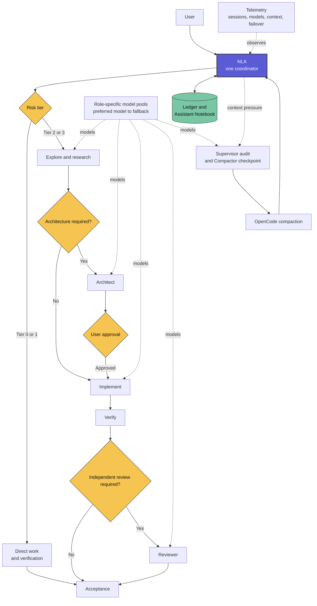

# Next Level Agent

Next Level Agent (NLA) is an OpenCode workflow for long or complex software development tasks. It keeps one coordinator responsible for the task while specialized agents handle research, architecture, implementation, review, supervision, and context recovery.

**Current NLA release:** `0.1.0-alpha.2` (`nla-v0.1.0-alpha.2`). NLA uses its
own Alpha release namespace; the inherited Superpowers package/manifests retain
their upstream `6.3.0` metadata. [`nla-version.json`](nla-version.json) is the
canonical machine-readable NLA version record.

## Philosophy

> Any task can be solved in a single prompt.

> Skills can change how a general-purpose model works. NLA adds coordination, role separation, model failover, memory, and context management around those skills.

The priorities are correctness, evidence, minimal necessary process, bounded context, recovery, and observable execution.

## Why NLA?

**NLA is a managed multi-agent system with one coordinator, specialized roles, explicit architecture, approval, and review stages, role-specific model pools, and state recovery. It is not a collection of prompts.**

- **One coordinator.** NLA owns the goal, user conversation, approvals, sequence, shared memory, and final acceptance.
- **Risk-based routing.** Small tasks stay with NLA. Larger or riskier tasks receive only the roles and gates they need.
- **Architecture before implementation.** Important designs and Tier 3 tasks go through Architect and user approval before code changes begin.
- **Independent checks.** Reviewer checks the result, while Supervisor checks workflow state, approvals, context pressure, and evidence.
- **Role-specific model pools.** Each child role can use a preferred model and bounded fallbacks, so one failed model does not have to stop the task.
- **Efficient context use.** Child agents receive focused task packets instead of the full conversation. Completed state is kept in structured memory rather than repeatedly copied into prompts.
- **Coordinator memory.** A private ledger and Assistant Notebook preserve decisions, verified facts, blockers, and the next step across a long task.
- **Automatic context protection.** OpenCode auto-compaction handles normal context pressure. NLA adds monitoring, a Supervisor audit, a Compactor checkpoint, and state restoration for controlled recovery.
- **Telemetry.** NLA records session relationships, selected models, failover, context usage, compaction, and restoration without copying the conversation itself.

Prompts define role behavior. The NLA plugin provides managed NLA delegation, model failover, child-session relationships, workflow memory, compaction, restoration, and telemetry.

## At a Glance



## What NLA Can Do

> **GPU Top**
>
> To test NLA on a real development task, I asked it to create an htop-style terminal monitor for an AMD Radeon 780M, Ollama models, and GPU processes.
>
> After I selected the initial parameters and approved the design, NLA planned the work, used specialized implementation and review roles, fixed issues found during review, ran the tests, and completed the working application without manual coding intervention.
>
> [View the GPU Top source and original task](https://github.com/pickleshell/utilities/tree/main/gpu-top).

## Architecture and Roles

NLA is the only user-facing coordinator and owns the shared memory. Specialized roles receive bounded assignments, work in child sessions, and return evidence to NLA.

| Role | Responsibility | Typical use |
| --- | --- | --- |
| **NLA** | Coordinates the complete task, talks to the user, owns memory, accepts the result, and handles direct Tier 0/1 work | Every task |
| **Router** | Classifies tasks and selects the appropriate workflow route and model class | At task-routing and model-routing boundaries |
| **Explorer** | Finds relevant files, symbols, dependencies, facts, and local risks | Tier 2/3 discovery |
| **Scout** | Researches official documentation, versions, and external dependencies | When local evidence is insufficient |
| **Architect** | Compares designs and defines boundaries, interfaces, failure handling, risks, and tests | Tier 3 design gate |
| **Implementer** | Performs a bounded code change and returns verification evidence | Approved Tier 2/3 implementation |
| **Reviewer** | Independently checks the scope, change, evidence, and quality | Risk-based review gate |
| **Supervisor** | Audits alignment, approvals, blockers, loops, context pressure, and completion evidence | Tier 3 gates, anomalies, compaction, completion |
| **Compactor** | Optimizes model input: compresses structured state, shapes prompts, and prunes tool schemas to a small relevant shortlist | Before controlled compaction and before model invocation when prompt optimization is enabled |

Supervisor does not become a second coordinator. Architect does not take over the user conversation. Subagents cannot use shared Notebook memory.

Router and Compactor have separate boundaries. Router handles task and model
routing only: it classifies the task, selects the workflow route, and identifies
the required model class or pool. It does not shape prompts or select tools.
Compactor owns prompt optimization before model invocation as well as context
compression. Given the already-bounded next step, it may remove redundant
context, shape the prompt without changing its meaning or acceptance criteria,
and prune or shortlist tool schemas so the target model receives only the small
relevant subset. NLA does not introduce a separate Selector role.

### Compactor prompt optimization

An OpenCode forensic comparison found that exposing the full toolset injected
approximately 16.7k prompt tokens of tool schemas for 31 tools before useful
user content. With `tools: false`, the prompt fell to approximately 126 tokens
and local `qwen3:4b` became fast. This indicates that tool-schema prefill, not
only model inference or task complexity, can dominate a small model's agent
latency.

That 31-tool observation is a separate forensic snapshot. The checked-in,
reproducible native Ollama benchmark resolved 15 public tools and reports schema
bytes and provider telemetry rather than retrofitting an estimated token count.
Both measurements are labeled separately in the status documentation.

Before each `nla_task` OpenCode child invocation, Compactor now selects a
relevant shortlist of approximately 2–5 tools rather than exposing every
available tool.
That target should reduce tool-schema prefill and context consumption by
roughly an order of magnitude while retaining the tools required for the
bounded assignment. It is especially important for small and local models, but
the same reduction may also lower latency and billed input cost for cloud
models. The bounded task packet is currently passed through unchanged; runtime
optimization prunes tool schemas but does not yet perform general prompt-text
rewriting.

Prompt optimization must preserve the task, safety constraints, permissions,
acceptance criteria, and provenance. It may narrow capabilities but may not
grant a tool that the target role is not allowed to use. A tool-free step gets
no schemas. If optimization is unavailable or its output is invalid, NLA uses a
conservative deterministic policy derived from the role and step; it does not
silently restore the full tool universe. If that policy cannot identify a safe
sufficient subset, the step fails closed for clarification, re-routing, or a
more capable model/runtime instead of risking an under-equipped or bloated
invocation.

OpenCode 1.18.9 exposes this control on `session.prompt` as a per-invocation
tool permission map. NLA sends an explicit wildcard deny followed by the
shortlist allows. This is the smallest native seam available; the map is stored
as child-session permission state, so retries in that child retain the same
restriction. A configured utility-runtime Compactor may refine the shortlist.
When it is not configured or its JSON is invalid, a deterministic role/step
policy is used. Unknown roles fail closed.

Stable role capability profiles are cached in the target project's ignored
`.opencode/nla-role-capabilities.json`. Each entry is keyed by the role,
NLA capability-cache version, relevant model-pool/config signature, and hashes
of the role-relevant OpenCode tool schemas. A matching entry avoids rebuilding
the role profile; a schema or configuration change produces a cache miss and a
new inspectable entry. Corrupt cache data is discarded and rebuilt only from
the current role ceiling and resolved schemas. Missing required tools still
fail closed. Compactor narrows the cached profile for each bounded step and can
never select a tool outside it.

NLA intentionally has two execution classes:

1. **Agent runtime:** OpenCode child sessions for roles that need multi-step
   reasoning, tools, repository navigation, or participation in the wider
   workflow.
2. **Utility-model runtime:** direct, single-shot calls for bounded
   transformations or analysis when orchestration supplies the complete packet
   and input data. This is a deliberate architecture for local, small, cheap,
   or specialized models, not a workaround for one model.

Compactor is the first proven utility-runtime consumer. Explorer may use it only
when all required data is supplied; an Explorer that must navigate the
repository or use tools belongs on the agent runtime. This claim does not extend
to Router. Architect, Implementer, and Supervisor requirements are unchanged.

A model can perform well on a narrow direct Ollama request yet perform poorly
inside a full OpenCode agent loop, where system instructions, tool protocols,
repository context, and runtime workflow add substantial overhead. The utility
runtime supports non-streaming Ollama HTTP and generic OpenAI-compatible
chat-completions endpoints. See [Project Status and Usage](docs/PROJECT_STATUS_AND_USAGE.md#utility-model-runtime)
for configuration, evidence, and failure behavior.

Bounded utility success is not evidence that the same model is suitable for a
full OpenCode child-agent loop. Mem0 is not an NLA-supported integration;
separate Mem0 testing is outside the Alpha release boundary.

The table describes the intended NLA role contracts. Some least-privilege boundaries are still enforced through role instructions rather than the complete hard permission matrix proposed in Draft 0.4. See the [implementation status audit](docs/DRAFT_0_4_IMPLEMENTATION_STATUS.md) for the exact boundary.

## Workflow

| Tier | Typical work | Route |
| --- | --- | --- |
| 0 | Answer or focused read-only inspection | NLA works directly |
| 1 | Small bounded change | Direct edit and targeted verification |
| 2 | Non-trivial implementation | Explore, implement, verify, review when required, checkpoint |
| 3 | Architecture or high-risk change | Clarify, explore, architect, approve, plan, implement, verify, review, checkpoint |

Tier 3 design and execution:

```text
NLA clarification
→ Explorer and optional Scout
→ Architect
→ user approval
→ implementation plan
→ Implementer
→ verification
→ Reviewer
→ Supervisor completion audit
→ checkpoint and acceptance
```

Controlled context recovery:

```text
NLA saves the deterministic ledger
→ required Supervisor audit
→ optional intelligent Compactor checkpoint
→ OpenCode summarization
→ ledger restoration
→ the same primary session continues
```

Compactor is a role, not a model binding. Its provider/model is selected through
the same configurable role pool as other NLA subagents. If the pool is omitted
or disabled, every configured model is unavailable, a request times out or
fails, or the returned checkpoint is invalid, NLA retains the deterministic
ledger and continues native compaction and restoration. AI compaction is never
a runtime dependency. The Supervisor audit remains a required safety gate: if
its pool is unavailable, fails, or blocks the operation, controlled compaction
stops rather than silently continuing to native summarization.

Small tasks use a shorter workflow. NLA adds agents and gates when risk and uncertainty justify them.

## Current Development Status

**Current maturity: Alpha, active development.** The core workflow, model failover, memory, controlled compaction, restoration, and telemetry have passed end-to-end tests.

> [!WARNING]
> NLA is an experimental Alpha developed and tested in a controlled personal OpenCode environment. It is not yet a hardened security boundary.

Current limitations include incomplete hard role permissions, no strict Task Context Packet validator, no hard token or monetary budgets, and no transactional installer or resolved-config validator. Controlled compaction requires a persistent OpenCode TUI or server.

This repository is based on Superpowers and retains some upstream integrations and tests. The complete NLA runtime is currently OpenCode-specific. Manifests for other agent platforms do not imply full NLA support on those platforms.

Read [Project Status and Usage](docs/PROJECT_STATUS_AND_USAGE.md) for the supported environment, installation model, known limitations, data locations, telemetry, evidence, and focused roadmap.

## Install

> [!WARNING]
> NLA is currently developed and tested specifically for OpenCode. Support for other coding-agent CLIs is not guaranteed. If you need another CLI, you are welcome to complete and test the integration.

Ask your OpenCode or Codex agent to clone this repository, read [`AGENTS.md`](AGENTS.md), and follow [`INSTALL.md`](INSTALL.md). Codex may assist with installation, but the complete NLA runtime currently runs in OpenCode.

```text
Clone https://github.com/pickleshell/next-level-agent.git, read AGENTS.md completely, and follow INSTALL.md to install and verify NLA for OpenCode. Preserve my existing configuration and credentials. Do not claim success without showing the resolved plugin, default agent, skills path, model pools, and smoke-test evidence.
```

## Documentation

- [Installation](INSTALL.md): supported Alpha setup for OpenCode.
- [Project Status and Usage](docs/PROJECT_STATUS_AND_USAGE.md): status, limitations, telemetry, storage, evidence, and roadmap.
- [Installation and Testing](docs/NLA_INSTALL_AND_TEST.md): detailed runtime behavior and verification.
- [Original Draft 0.4](TECHNICAL_SPECIFICATION.md): the original product and architecture specification.
- [Draft 0.4 Implementation Status](docs/DRAFT_0_4_IMPLEMENTATION_STATUS.md): what is implemented, partial, absent, or intentionally deferred.
- [NLA Modifications](NLA_MODIFICATIONS.md): the boundary between Superpowers and NLA additions.
- [Testing](docs/testing.md): deterministic CI gates and optional real-model evidence.
- [Optional Mem0 tools](docs/NLA_MEM0_PLUGIN.md): separate HTTP plugin for durable semantic memory.
- [Contributing](CONTRIBUTING.md): contribution and evidence requirements.
- [Security](SECURITY.md): Alpha threat boundary and private reporting guidance.
- [Superpowers](https://github.com/obra/superpowers): the upstream skills-first development methodology.
- [Assistant Notebook](https://github.com/pickleshell/skills/tree/main/assistant-notebook): the durable fast-memory skill used by NLA.

## History

NLA started as the independent [Next-Level OpenCode Profile Draft 0.4](TECHNICAL_SPECIFICATION.md), a plan for OpenCode orchestration, risk routing, specialized roles, bounded context, verification, memory, safety, and cost measurement.

While reviewing the plan, I asked Grok to find similar systems. Superpowers was one of several alternatives. Its skills-based approach was close to what I had planned, and it already provided a useful development workflow. I tested it on a simple task and chose it as a quick start instead of rebuilding the same workflow skills.

Superpowers is the implementation base, not the origin of the NLA plan. NLA adds risk tiers, architecture and review gates, supervision, model pools, memory, controlled compaction, and telemetry for OpenCode.

I am also working on larger multi-agent systems. Running a small version locally that completes useful tasks feels like having a toy robot that can actually help around the house.

## Contact

Open a GitHub issue to report a bug, suggest an improvement, or ask for help.

- [Create an issue](https://github.com/pickleshell/next-level-agent/issues/new)
- [Browse existing issues](https://github.com/pickleshell/next-level-agent/issues)
- Email: [pickleshell.plugin@gmail.com](mailto:pickleshell.plugin@gmail.com)

## Credits and License

Next Level Agent and its original components are licensed under the
[MIT License](LICENSE).

Copyright © 2026 PickleShell.

This repository includes components derived from
[Superpowers](https://github.com/obra/superpowers). Those components remain
Copyright © 2025 Jesse Vincent and are distributed under their original
[MIT License](LICENSES/SUPERPOWERS.txt).

Assistant Notebook comes from [pickleshell/skills](https://github.com/pickleshell/skills).

See [NLA_MODIFICATIONS.md](NLA_MODIFICATIONS.md) for the separation between
original NLA components and inherited Superpowers components.
